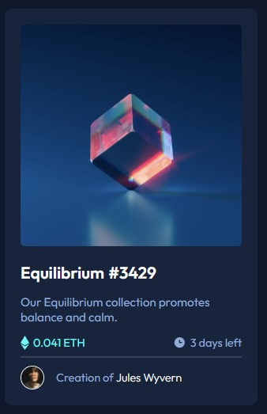

# Frontend Mentor - NFT preview card component solution

This is a solution to the [NFT preview card component challenge on Frontend Mentor](https://www.frontendmentor.io/challenges/nft-preview-card-component-SbdUL_w0U). Frontend Mentor challenges help you improve your coding skills by building realistic projects.

## Table of contents

- [Overview](#overview)
  - [The challenge](#the-challenge)
  - [Screenshot](#screenshot)
- [My process](#my-process)
  - [Built with](#built-with)
  - [What I learned](#what-i-learned)

**Note: Delete this note and update the table of contents based on what sections you keep.**

## Overview

### The challenge

Users should be able to:

- View the optimal layout depending on their device's screen size
- See hover states for interactive elements

### Screenshot




## My process

### Built with

- Semantic HTML5 markup
- CSS custom properties
- Flexbox
- CSS Grid
- Mobile-first workflow


**Note: These are just examples. Delete this note and replace the list above with your own choices**

### What I learned

Show image in top of another with transparent background on mouse hover

```css
#eye-container {
    visibility: hidden;
    position: absolute;
    top: 0;
    left: 0;
    min-width: 100%;
    height: 100%;
    display: flex;
    border-radius: inherit;
    -webkit-border-radius: inherit;
    -moz-border-radius: inherit;
    -ms-border-radius: inherit;
    -o-border-radius: inherit;
    align-content: center;
    justify-content: center;
    align-items: center;
}

#eye-container img {
    max-width: 35px;
    height: auto;
}

.img-container:hover #eye-container {
    visibility: visible;
    background-color: hsla(178, 100%, 50%, 0.7);
    width: 30px;
}
```
